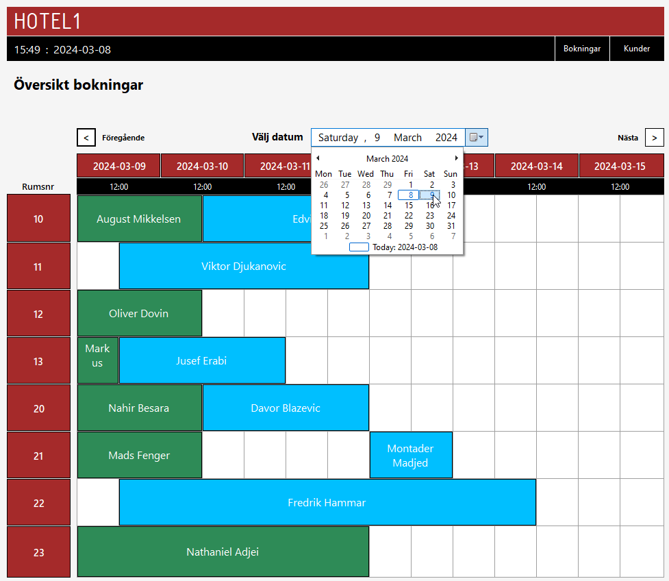

# Hotel Booking App - WinForms .NET

## Project Overview
This desktop application, built using WinForms in .NET, allows users to perform CRUD operations for hotel guests and room bookings. The app also features a graphical calendar overview, providing a user-friendly interface for booking rooms by clicking on specific dates.

## Features
### Guest Management:
CRUD operations for hotel guest information.

### Room Booking:
CRUD operations for managing room bookings.

### Graphical Calendar Overview:
Visual representation of a calendar for easy navigation and booking.

### Technologies Used
WinForms .NET: Framework for creating the desktop application.

C#: Primary programming language for application logic.

SQL Server: Database management system used for storing and retrieving hotel guest and room booking information.
